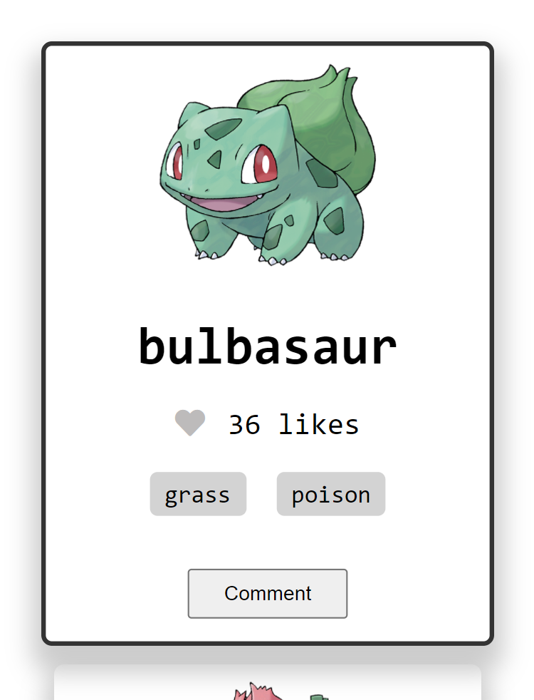

# Poke-Dex

> Poke-Dex is an API based webapp that displays cards containing information (like their image, type and location) about different pokemon. This is a single-page application(SPA) which contains the home page and comments modal pop-ups. Users can clike the `heart` icon to give a like to their favorite and post comments by clicking on the `comment` button in the modal.  

# Demo Link

Click [here](https://rpire.github.io/Poke-dex/dist/) to view the website online.
# Screenshot

Width - 1440px

Width - 375px

# Getting Started

To get a local copy up and running follow these simple steps.

- You can clone this repo by typing `git clone https://github.com/rpire/Poke-dex.git` on your terminal.

- Type `cd Poke-dex` to access the project on the terminal.
  
- Run `npm install` from your editor's terminal.

- Run `npm run build` from your editor's terminal.

- Run `npm start` from your editor's terminal to view the project in your browser.

- Run `npx hint` . to check for HTML Linter errors.

- Run `npx stylelint "**/*.{css,scss}"` to check for CSS Linter errors.

# This project was built with:

HTML5

CSS3

JavaScript

Webpack

Jest Library
# Version Control System

GIT

# 👤 Authors

👤 **Adedamola M. Shittu**

GitHub: [@dammyShittu](https://github.com/DammyShittu/)

Twitter: [@aded_shittu](https://twitter.com/aded_shittu/)

LinkedIn: [Adedamola Shittu](linkedin.com/in/adedamola-shittu-3ab465172/)

👤 **Rubén D. Pire**

GitHub: [Rubén D. Pire](https://github.com/rpire)

LinkedIn: [Rubén D. Pire](https://www.linkedin.com/in/rub%C3%A9n-dar%C3%ADo-pire-l%C3%B3pez-507111189/)

# 🤝 Contributing

Contributions, issues, and feature requests are welcome!

Feel free to check the [issues page](https://github.com/rpire/Poke-dex/issues).

# Show your support

Give a ⭐️ if you like this project!

# Acknowledgement

- A big thanks to [PokeAPI](https://pokeapi.co/) for making the API endpoints readily available for use.
- A big thanks to [@microverseinc](https://github.com/microverseinc) for providing the involvement API.

# 📝 License

This project is [MIT](LICENSE) licensed.

